# Sistema de Reservas de Espacios Institucionales

Aplicación web full-stack para la **gestión y reserva de espacios institucionales** (salas, laboratorios, auditorios y aulas). Permite a los usuarios solicitar reservas en franjas horarias disponibles y a los administradores aprobarlas, rechazarlas y gestionar el catálogo de espacios y usuarios.

## Objetivo

Automatizar y centralizar la reserva de espacios físicos de una institución educativa, eliminando conflictos de horario, garantizando el cumplimiento de las políticas institucionales (anticipación mínima, horarios permitidos, capacidad de aforo) y diferenciando las capacidades según el rol del usuario (`admin` / `usuario`).

---

## 👥 Integrantes del equipo

| Nombre | Rol |
| --- | --- |
| Santiago Arenas Herrera | Documentacion y pruebas |
| Bryan Alejandro Ruiz Restrepo | Integracion del main y dev |
| Juan Manuel Gallego Rojas | Despliegue y ops |

---

## ¿Qué hace la aplicación y qué problema resuelve?

### Problema que resuelve

En entornos institucionales, la asignación manual de espacios genera frecuentes **conflictos de horario**, reservas duplicadas, uso ineficiente de instalaciones y falta de visibilidad sobre la disponibilidad real. Este sistema centraliza y automatiza ese proceso.

### Funcionalidades principales

| Funcionalidad | Rol requerido |
| --- | --- |
| Registro e inicio de sesión | Todos |
| Consultar espacios disponibles (con filtros de fecha, hora y aforo) | Autenticado |
| Crear una solicitud de reserva | Autenticado |
| Consultar el historial de reservas propias | Autenticado (`usuario`) |
| Cancelar una reserva propia | Autenticado |
| Ver todas las reservas del sistema | Admin |
| Aprobar o rechazar solicitudes de reserva | Admin |
| Crear, editar y cambiar el estado de espacios | Admin |
| Gestionar usuarios (editar, activar/inactivar) | Admin |

### Reglas de negocio aplicadas automáticamente

- **Anticipación mínima:** no se aceptan reservas con menos de 24 horas de anticipación.
- **Horario institucional:** lunes a viernes de 7:00 a 20:00; sábados de 8:00 a 12:00; domingos no disponibles.
- **Sin solapamiento:** el sistema detecta y rechaza reservas que se crucen en fecha y franja horaria para el mismo espacio.
- **Capacidad:** la cantidad de asistentes no puede superar la capacidad del espacio.
- **Estado del espacio:** no se pueden reservar espacios inactivos, en mantenimiento o no disponibles.
- **Flujo de estados:** toda reserva nace en `esperando`; solo un administrador puede pasarla a `aprobada` o `rechazada`.

---

## Arquitectura general y tecnologías utilizadas

### Diagrama de arquitectura

```
┌──────────────────┐     HTTP + JWT      ┌──────────────────┐     ORM      ┌──────────────┐
│   Frontend SPA   │ ──────────────────► │   Backend API    │ ───────────► │  SQL Server  │
│  React + Vite    │ ◄────────────────── │     FastAPI      │ ◄─────────── │  (pymssql)   │
└──────────────────┘    JSON / REST      └──────────────────┘   SQLAlchemy └──────────────┘
```

- **Frontend:** SPA en React que consume la API REST y gestiona la sesión con JWT almacenado en `localStorage`.
- **Backend:** API REST en FastAPI con arquitectura modular por capas (routers → schemas → crud → models).
- **Base de datos:** SQL Server 2022, accedida mediante el ORM SQLAlchemy con el driver `pymssql`.
- **Autenticación:** JWT (HS256) emitido por el backend; el frontend lo adjunta en cada petición vía interceptor de Axios.

### Tecnologías utilizadas

#### Backend

| Tecnología | Uso |
| --- | --- |
| **Python 3.11+** | Lenguaje base |
| **FastAPI** | Framework web / API REST + Swagger automático |
| **Uvicorn** | Servidor ASGI |
| **SQLAlchemy** | ORM |
| **SQL Server** (`pymssql`) | Base de datos relacional |
| **Pydantic** | Validación y serialización (schemas) |
| **python-jose** | Tokens JWT |
| **passlib + bcrypt** | Hash seguro de contraseñas |
| **python-dotenv** | Variables de entorno |

#### Frontend

| Tecnología | Uso |
| --- | --- |
| **React 19** | UI basada en componentes |
| **Vite** | Bundler / servidor de desarrollo |
| **React Router DOM 7** | Enrutamiento SPA |
| **Axios** | Cliente HTTP con interceptores JWT |
| **jwt-decode** | Decodificación del token (rol, expiración) |
| **Tailwind CSS 3** | Sistema de estilos y diseño |
| **lucide-react** | Biblioteca de iconos |

### Modelo de datos (Entidad-Relación)

```
┌─────────────────────┐          ┌─────────────────────┐
│      usuarios       │          │      espacios        │
├─────────────────────┤          ├─────────────────────┤
│ PK id_usuario       │          │ PK id_espacio        │
│    nombre           │          │    nombre            │
│    correo (único)   │          │    ubicacion         │
│    contrasena (hash)│          │    capacidad         │
│    rol              │          │    estado            │
│    estado           │          └───────────┬─────────┘
└──────────┬──────────┘                      │
           │ 1:N                             │ 1:N
           │         ┌─────────────────────┐ │
           └────────►│      reservas       │◄┘
                     ├─────────────────────┤
                     │ PK id_reserva       │
                     │ FK id_usuario       │
                     │ FK id_espacio       │
                     │    fecha            │
                     │    hora_inicio      │
                     │    hora_fin         │
                     │    cantidad_asist.  │
                     │    estado           │
                     └─────────────────────┘
```

---

## Despliegue con Docker Compose

El proyecto incluye un archivo `docker-compose.yml` que levanta los tres servicios necesarios con un solo comando.

### Servicios y puertos

| Servicio | Contenedor | Puerto expuesto | Descripción |
|---|---|---|---|
| `db` | `sqlserver_lab4` | `1433` | SQL Server 2022 (Developer Edition) |
| `db-init` | `sqlserver_init` | — | Inicializa el esquema SQL al arrancar |
| `backend` | `fastapi_lab4` | `8000` | API FastAPI (Uvicorn) |
| `frontend` | `react_lab4` | `5173` | Aplicación React (build de producción) |

### Variables de entorno requeridas

Crea un archivo `.env` en la raíz del proyecto (basado en `.env.example`):

```env
DB_PASSWORD=TuPasswordSeguro123!
DATABASE_URL=mssql+pymssql://sa:TuPasswordSeguro123!@db:1433/lab4_reservas
SECRET_KEY=cambia-esto-por-una-clave-larga-y-aleatoria
```

### Comandos de despliegue

```bash
# Linux / WSL — desde la raíz del proyecto
docker compose up --build -d

# Ver logs
docker compose logs -f

# Detener
docker compose down
```

> **Rama de operaciones:** el archivo `docker-compose.yml` y la configuración de contenedores se encuentra en la rama **`ops`** del repositorio.

### Acceso a la aplicación

- **Frontend:** <http://localhost:5173>
- **Backend (API):** <http://localhost:8000>
- **Swagger UI:** <http://localhost:8000/docs>

---

## Tutorial de uso

### Credenciales del administrador inicial

| Campo | Valor |
| --- | --- |
| Correo | `admin@institucion.edu` |
| Contraseña | `Admin123!` |

---

### 1. Inicio de sesión

Accede a <http://localhost:5173> e ingresa tus credenciales en el formulario de inicio de sesión.

> 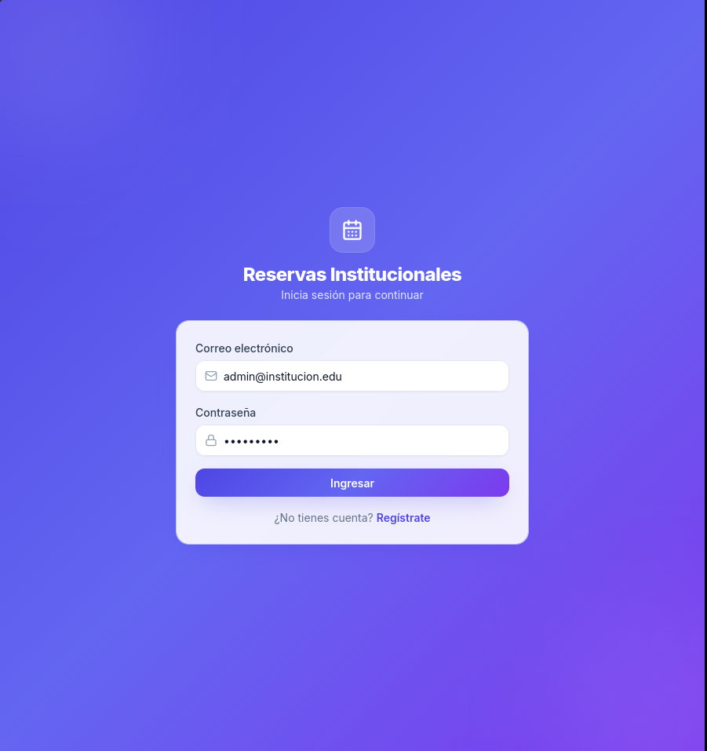

---

### 2. Dashboard

Tras iniciar sesión, el sistema te redirige al **Dashboard** donde puedes ver un resumen de tus reservas activas.

> 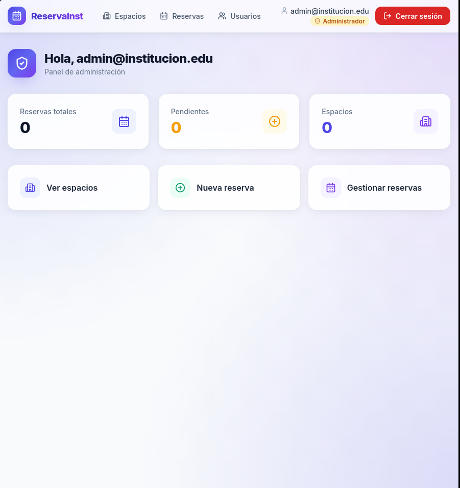

---

### 3. Crear una reserva

1. Haz clic en **Nueva Reserva** en la barra de navegación.
2. Selecciona la **fecha**, la **hora de inicio** y la **hora de fin**.
3. Ingresa la **cantidad de asistentes**.
4. El sistema filtrará automáticamente los espacios disponibles para esa franja horaria.
5. Selecciona un espacio y confirma la reserva.
6. La reserva quedará en estado **`esperando`** hasta que un administrador la apruebe.

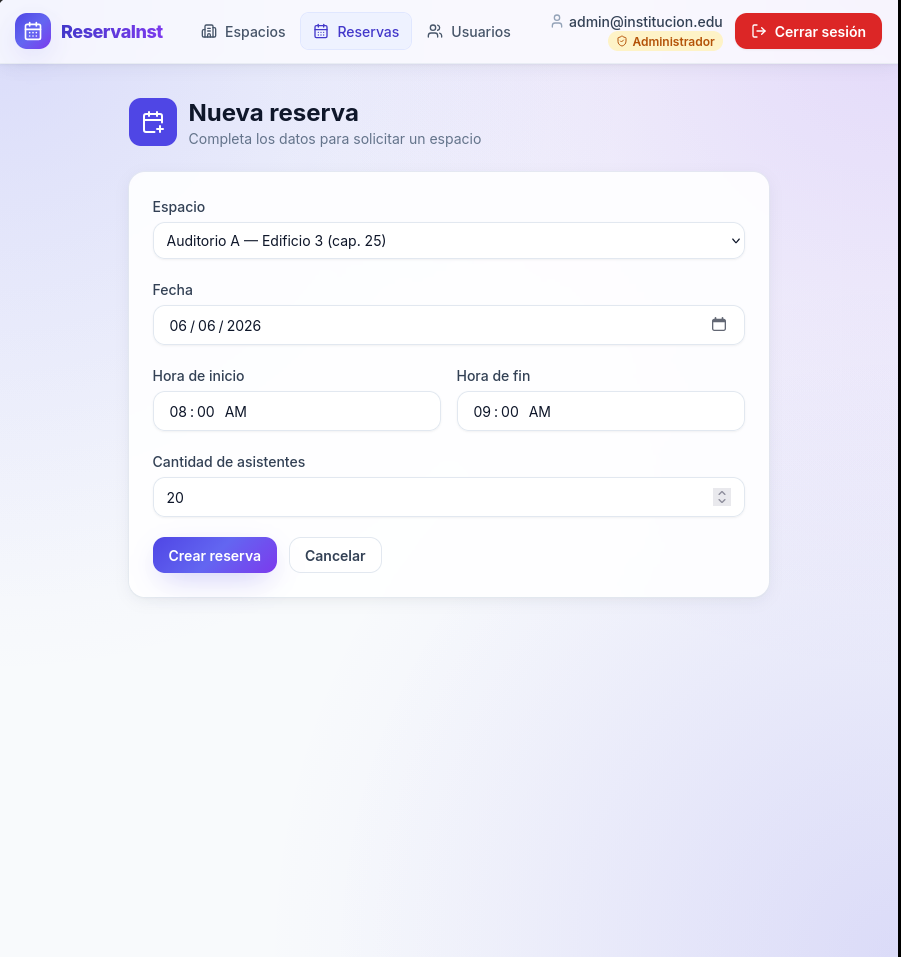

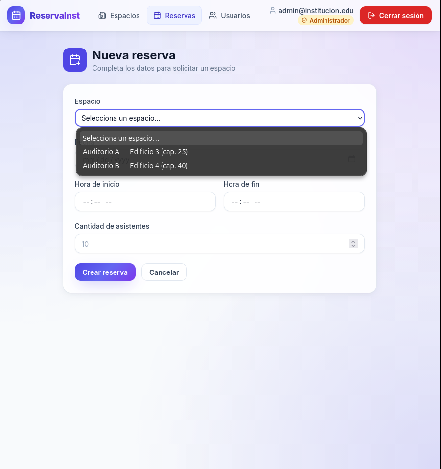

---

### 4. Consultar reservas

En la sección **Mis Reservas** puedes ver el historial completo de tus solicitudes y su estado actual (`esperando`, `aprobada`, `rechazada`, `cancelada`).

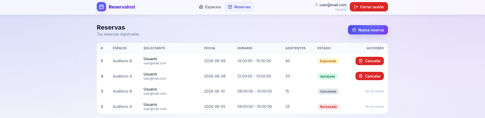

---

### 5. Cancelar una reserva

Desde **Mis Reservas**, haz clic en el botón **Cancelar** en cualquier reserva con estado `esperando` o `aprobada`.

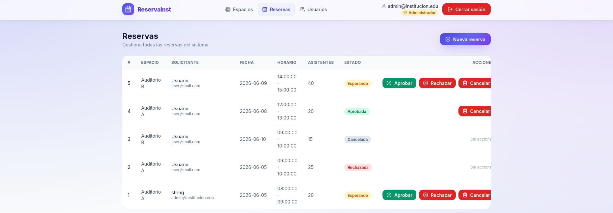

---

### 6. Gestión de espacios (solo Admin)

En la sección **Espacios** el administrador puede:

- **Crear** nuevos espacios con nombre, ubicación, capacidad y estado.
- **Editar** la información de un espacio existente.
- **Cambiar el estado** de un espacio (`activo`, `inactivo`, `en mantenimiento`, `no disponible`).

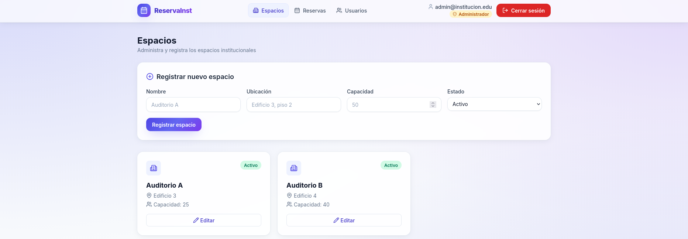

---

### 7. Gestión de usuarios (solo Admin)

En **Usuarios**, el administrador puede:

- Ver el listado completo de usuarios registrados.
- Editar los datos de un usuario (nombre, correo, rol, contraseña).
- Activar o inactivar una cuenta.

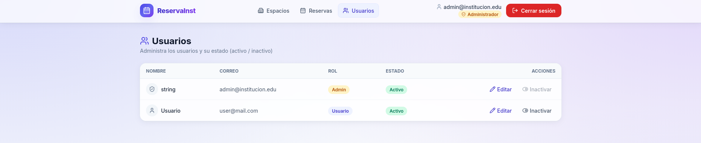

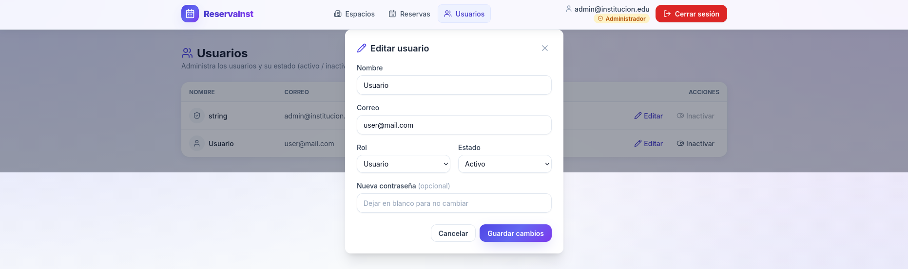
---

### 8. Mensajes de error

El sistema muestra mensajes claros cuando una acción no es válida. Ejemplos:

| Situación | Mensaje mostrado |
|---|---|
| Reserva con menos de 24 h de anticipación | `"La reserva debe hacerse con al menos 24 horas de anticipación."` |
| Horario fuera del rango institucional | `"El horario debe estar dentro del rango permitido."` |
| Conflicto de horario con otra reserva | `"Ya existe una reserva para este espacio en ese horario."` |
| Asistentes superan la capacidad | `"La cantidad de asistentes supera la capacidad del espacio."` |
| Credenciales incorrectas | `"Correo o contraseña incorrectos."` |
| Usuario inactivo | `"Tu cuenta está inactiva. Contacta al administrador."` |

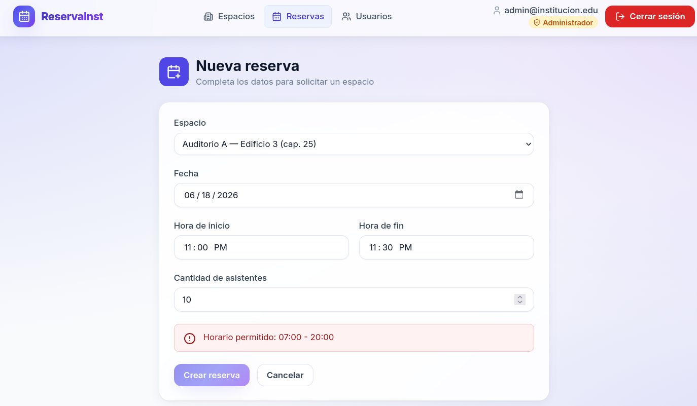
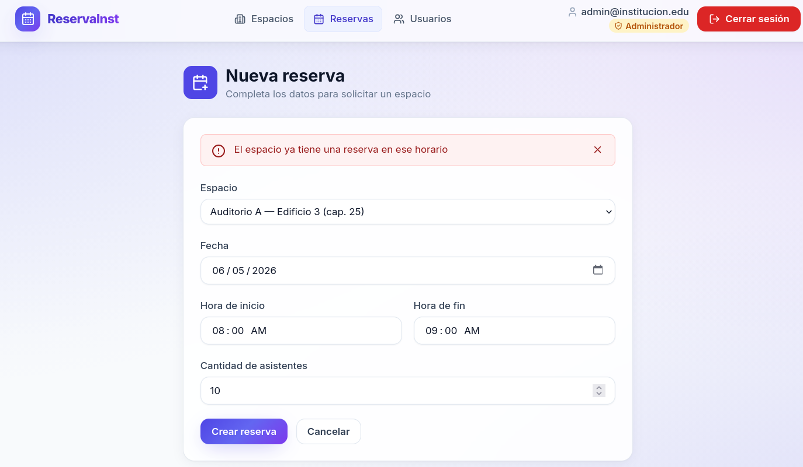
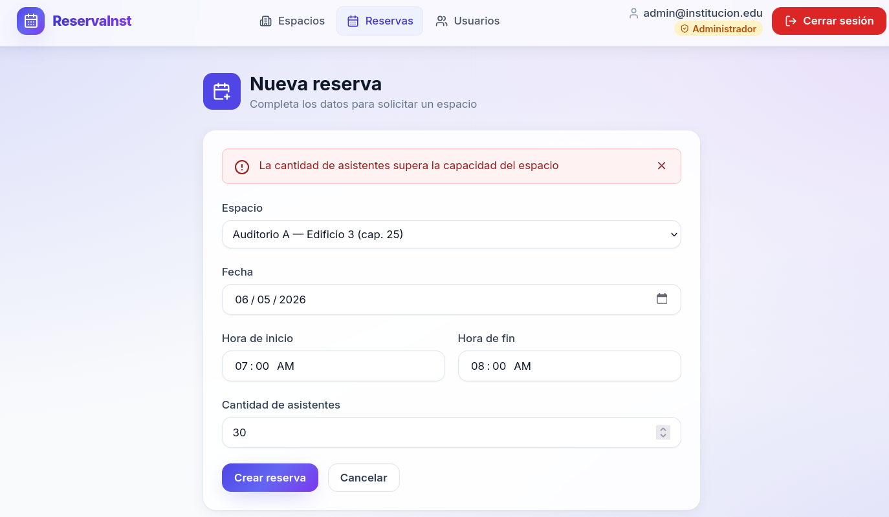
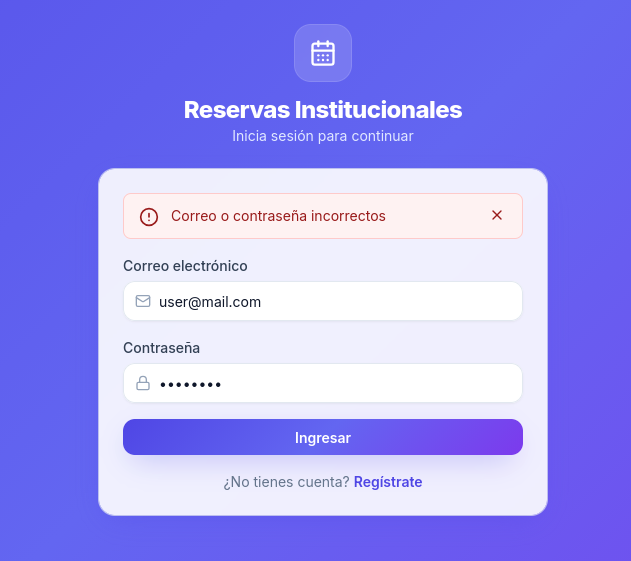
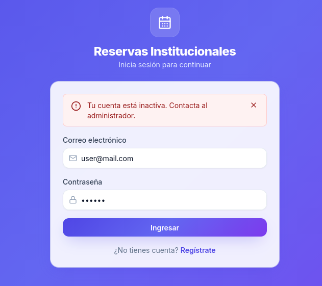
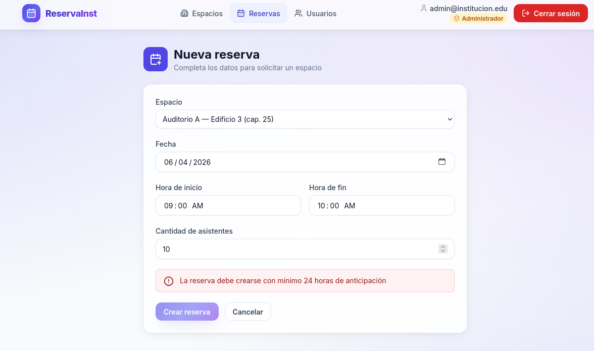

---

## 🎓 Conclusiones, dificultades, aprendizajes y mejoras futuras

### Conclusiones

Este proyecto permitió al equipo afianzar conocimientos en el desarrollo de aplicaciones web completas, abarcando desde la gestión de bases de datos hasta la interfaz de usuario. La integración de diferentes tecnologías (Python, SQL Server, React) bajo un sistema de contenedores (Docker) facilitó el despliegue y la escalabilidad de la solución. Además, se fortaleció la capacidad de trabajo colaborativo, la resolución de problemas técnicos y la aplicación de metodologías de desarrollo ágiles.

### Dificultades encontradas

En el transcurso del desarrollo del proyecto, surgieron desafíos principalmente relacionados con la integración de los diferentes componentes de la arquitectura. La configuración de la base de datos SQL Server y la correcta conexión con la API de FastAPI requirieron ajustes precisos para asegurar la persistencia y recuperación de datos. Asimismo, la sincronización entre el frontend y el backend presentó dificultades iniciales que se fueron resolviendo mediante la implementación de mecanismos de comunicación robustos y eficientes. Estas dificultades permitieron al equipo desarrollar habilidades de depuración y optimización en entornos distribuidos.

### Aprendizajes

Durante el desarrollo de este proyecto, el equipo adquirió aprendizajes significativos en diversas áreas tecnológicas y metodológicas. En primer lugar, se fortalecieron las competencias en el manejo de bases de datos SQL Server, comprendiendo su arquitectura, consultas avanzadas y administración eficiente. La integración con FastAPI permitió profundizar en el desarrollo de APIs RESTful, implementando autenticación, autorización y manejo de datos de manera segura y escalable. Además, la experiencia con React y Next.js proporcionó conocimientos sólidos en la construcción de interfaces de usuario interactivas y optimizadas para la experiencia del usuario. En el ámbito de la infraestructura, la familiarización con Docker y Docker Compose facilitó la comprensión de los principios de contenedorización y despliegue de aplicaciones en entornos distribuidos. Finalmente, se consolidaron prácticas de trabajo en equipo, planificación de proyectos y resolución colaborativa de problemas.

### Mejoras futuras

- Implementar notificaciones por correo electrónico al aprobar/rechazar una reserva.
- Agregar una vista de calendario para visualizar la disponibilidad de espacios de forma gráfica.
- Permitir reservas recurrentes (semanal, mensual).
- Implementar un sistema de reportes y estadísticas de uso por espacio.
- Migrar la autenticación a un proveedor externo (OAuth 2.0 institucional).
- Añadir soporte para adjuntar documentos justificativos a la solicitud de reserva.
